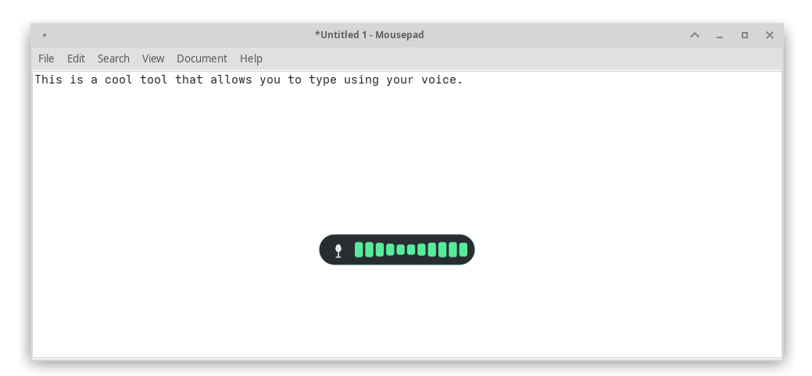
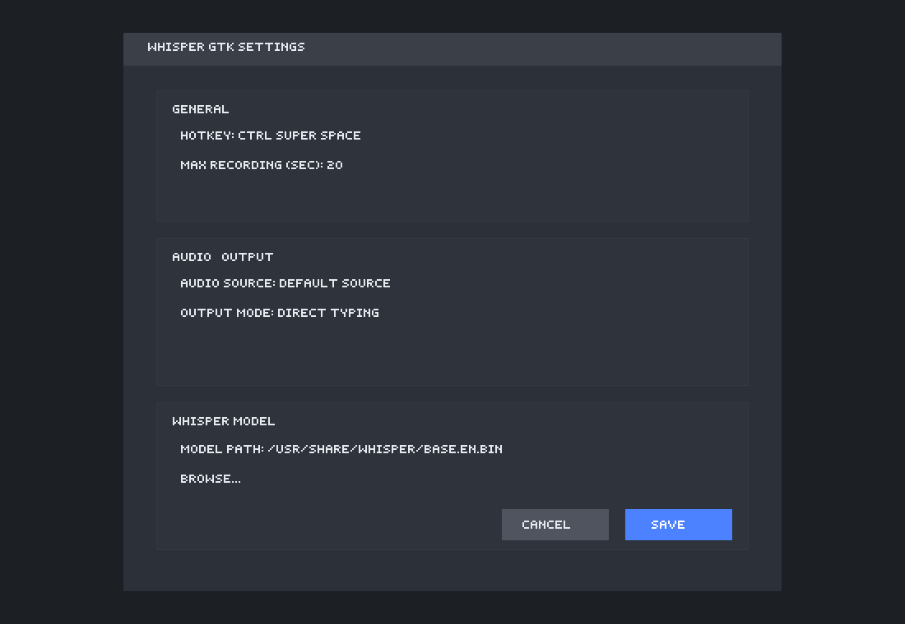

# Whisper GTK

> Warning: This project was vibe coded with minimal review. Use and package it with that in mind.
>
> Note: Per US copyright law, works authored by AI are not protected by copyright, and are thus Public Domain. However, the human-authored elements of this project are protected by copyright, and are licensed under GPL v3.

Whisper GTK is a small Linux/X11 GTK4 background app for push-to-talk dictation. It listens for a configurable global hotkey, records microphone audio while the hotkey is held, shows a compact recording overlay, transcribes the capture with `whisper.cpp-base.en`, and inserts the resulting text into the active application. It also provides a StatusNotifier tray icon with Settings and Quit actions.

## Features

- Hold-to-record global hotkey on X11
- PulseAudio capture through native `libpulse` / `libpulse-simple`
- Small bottom-screen recording overlay with microphone icon and live waveform
- Silence/short-recording gate to avoid transcribing blank audio
- Transcription through `whisper.cpp-base.en`
- Text output through direct `xdotool type` or clipboard paste
- GTK4 settings window for hotkey, audio source, output mode, and maximum recording duration
- StatusNotifier tray icon with Settings and Quit menu items
- Arch Linux packaging files under `releng/arch`

## Screenshots

### Recording Overlay



### Settings



## Requirements

Runtime:

- Linux with an X11 session or XWayland-compatible setup
- GTK4
- PulseAudio-compatible audio server
- `xdotool`
- `whisper.cpp-base.en` available on `PATH`

Build time:

- Rust stable toolchain
- Cargo
- GTK4 development files
- X11 and Xrandr development files

On Arch Linux, the package metadata lists:

```bash
gtk4 glibc libgcc libx11 libxrandr libpulse xdotool whisper.cpp
```

## Building

Build a debug binary:

```bash
cargo build
```

Build an optimized release binary:

```bash
cargo build --release --frozen
```

Run tests:

```bash
cargo test --frozen
```

Run clippy:

```bash
cargo clippy --frozen -- -D warnings
```

## Running

From the repository:

```bash
cargo run
```

Or after a release build:

```bash
target/release/whisper-gtk
```

The desktop entry forces GTK's X11 backend:

```ini
Exec=env GDK_BACKEND=x11 whisper-gtk
```

## Usage

1. Start `whisper-gtk`.
2. Open Settings from the tray icon.
3. Configure the hotkey, audio source, output mode, and maximum recording duration.
4. Hold the hotkey to record.
5. Release the hotkey to transcribe and insert the text.

If the recording is too short or too quiet, it is discarded without running Whisper.

## Configuration

Settings are stored in:

```text
$XDG_CONFIG_HOME/whisper-gtk/config.json
```

If `XDG_CONFIG_HOME` is unset, the fallback path is:

```text
~/.config/whisper-gtk/config.json
```

## Arch Package

Packaging files are in:

```text
releng/arch/PKGBUILD
dist/whisper-gtk.desktop
```

From `releng/arch`, build with:

```bash
makepkg
```

The current PKGBUILD is intended for this repository layout and builds from the local checkout.

## Limitations

- Global hotkeys and text injection are X11-specific.
- Native Wayland sessions are not currently supported.
- `whisper.cpp-base.en` must be installed separately and available on `PATH`.
- The app currently targets one transcription model command rather than exposing model selection in settings.
