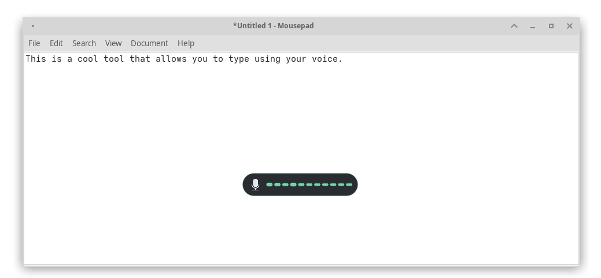
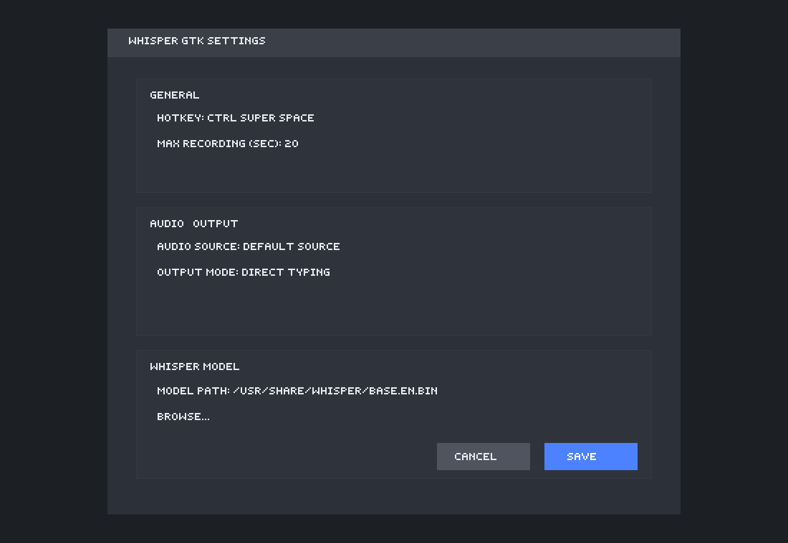

# Whisper GTK

> Warning: This project was vibe coded with minimal review. Use and package it with that in mind.
>
> Note: Per US copyright law, works authored by AI are not protected by copyright, and are thus Public Domain. However, the human-authored elements of this project are protected by copyright, and are licensed under GPL v3.

Whisper GTK is a small Linux/X11 GTK4 background app for push-to-talk dictation. It listens for a configurable global hotkey, records microphone audio while the hotkey is held, shows a compact recording overlay, transcribes the capture locally with whisper.cpp through `whisper-rs`, and inserts the resulting text into the active application. It also provides a StatusNotifier tray icon with Settings and Quit actions.

## Features

- Hold-to-record global hotkey on X11
- PulseAudio capture through native `libpulse` / `libpulse-simple`
- Small bottom-screen recording overlay with microphone icon and live waveform
- Silence/short-recording gate to avoid transcribing blank audio
- In-process transcription through `whisper-rs` with a local whisper.cpp model
- Text output through `libxdo` or clipboard paste
- GTK4 settings window for hotkey, audio source, output mode, maximum recording duration, model selection, and Whisper CPU threads
- StatusNotifier tray icon with Settings and Quit menu items
- Arch Linux packaging files under `releng/arch`

## Screenshots

### Recording Overlay



### Settings



## Requirements

Runtime:

- Linux with an X11 session
- GTK4
- PulseAudio-compatible audio server and `libpulse` / `libpulse-simple`
- X11 and Xrandr libraries
- `libxdo.so` via the Arch `xdotool` package
- A compatible whisper.cpp `ggml-*.bin` model file (see [Models](#models))
- A session D-Bus and StatusNotifier-compatible tray host for the tray icon

The transcription engine is built into the app through `whisper-rs`; a separate whisper.cpp command on `PATH` is not required. Model files must be obtained separately.

Build time:

- Current Rust stable toolchain with Cargo
- C/C++ compiler, CMake, and a build tool such as Make or Ninja for whisper.cpp
- Clang / libclang for binding generation
- `pkg-config`
- GTK4 development files
- X11 and Xrandr development files
- PulseAudio and libxdo development files

On Arch Linux, the PKGBUILD lists these runtime dependencies:

```text
gtk4 glibc libgcc libx11 libxrandr libpulse xdotool
```

Its declared build dependencies are `cargo` and `git`. The native build tools listed above are also needed when building from source; the PKGBUILD does not currently declare CMake or Clang. It does not install a model.

## Building

Run these commands from the repository root on Linux after installing the build dependencies. Fetch the locked dependencies before using the offline `--frozen` commands below:

```bash
cargo fetch --locked
```

Build a debug binary:

```bash
cargo build --locked
```

Build an optimized release binary:

```bash
cargo build --release --frozen
```

Run tests:

```bash
cargo test --frozen
```

Run clippy:

```bash
cargo clippy --frozen -- -D warnings
```

## Running

From the repository:

```bash
GDK_BACKEND=x11 cargo run --locked
```

Or after a release build:

```bash
GDK_BACKEND=x11 target/release/whisper-gtk
```

The desktop entry forces GTK's X11 backend:

```ini
Exec=env GDK_BACKEND=x11 whisper-gtk
```

## Usage

1. Start `whisper-gtk`.
2. Open Settings from the tray icon. Settings also opens on startup if no configuration file exists.
3. Select a model and configure the hotkey, audio source, output mode, maximum recording duration, and Whisper CPU threads.
4. Focus the application you want to type into, then hold the hotkey to record (F8 by default).
5. Release the hotkey to transcribe and insert the text.

Recording also stops at the configured maximum duration (30 seconds by default). If the recording is too short or too quiet, it is discarded without transcription.

## Models

Obtain a whisper.cpp model in GGML format, such as `ggml-base.en.bin`, using the [upstream model download instructions](https://github.com/ggml-org/whisper.cpp/tree/master/models). Whisper GTK does not download models automatically.

The Model section in Settings lists `ggml-*.bin` files found directly inside `/usr/share/whisper.cpp-model-*` directories. Use **Browse...** or **Other...** to select a model stored elsewhere. A new selection is loaded for validation before its path is saved.

At transcription time, the model path is chosen in this order:

1. The saved `model_path` setting, if present.
2. The `WHISPER_MODEL_PATH` environment variable, if set.
3. `/usr/share/whisper.cpp-model-base.en/ggml-base.en.bin`, if it exists.
4. The first discovered model under `/usr/share/whisper.cpp-model-*`, sorted by path.

If no model is discovered, the app still attempts the default `base.en` path and reports a loading error. It does not fall back to another model when an explicitly configured path fails.

For example, to use a downloaded model when `model_path` is unset or `null`:

```bash
WHISPER_MODEL_PATH="$HOME/models/ggml-base.en.bin" GDK_BACKEND=x11 cargo run --locked
```

A saved model selection takes precedence over this environment variable. Use an absolute path when configuring a model manually; `~` and environment variables inside the saved path are not expanded.

If transcription fails, run the app from a terminal to see model-loading, audio, or output errors.

## Configuration

Settings are stored in:

```text
$XDG_CONFIG_HOME/whisper-gtk/config.json
```

If `XDG_CONFIG_HOME` is unset, the fallback path is:

```text
~/.config/whisper-gtk/config.json
```

## Arch Package

Packaging files are in:

```text
releng/arch/PKGBUILD
dist/whisper-gtk.desktop
```

From `releng/arch`, build with:

```bash
makepkg
```

The current PKGBUILD clones `https://github.com/tyzoid/whisper-gtk.git` and builds that source. It does not build uncommitted changes from the local checkout. Use the Cargo commands above to build local changes.

## Limitations

- Global hotkeys and text injection are X11-specific.
- Native Wayland sessions are not currently supported. Forcing GTK's X11 backend does not add native Wayland hotkey or text-injection support.
- Windows is not currently supported. The app depends on Linux/X11 desktop integration, and there is no validated Windows build or installation procedure.
- Model files must be installed or downloaded separately.
